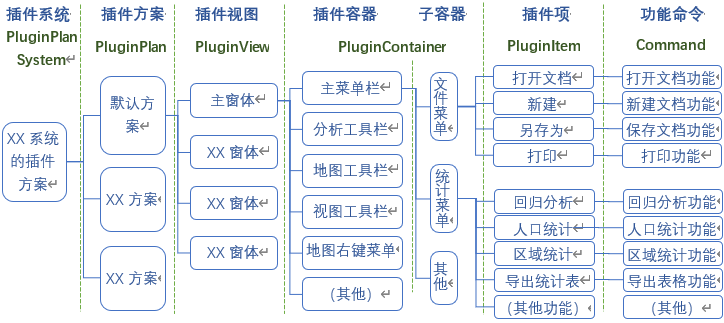

## 插件功能

`WLib`和`WLib.WinCtrl`库为WinForm插件式应用提供基本的插件组件和管理功能，本插件功能并不成熟，仅为基本的、简单的插件开发需求做准备。

### 简介

该功能为WinForm插件式开发服务，在程序设计上，可将部分或整个WinForm程序的各个具体业务功能当成插件，与主界面上的基础UI进行交互，整个应用程序的功能可相对自由地组合。

插件组件整体层级结构为：

* 功能命令（Command）：调用具体功能的命令。也可以是具体的功能本身。
* 插件项（Plugin Item）：嵌入到界面中的插件，通常代表界面中的一个菜单项或工具栏上的工具、按钮等。
* 插件容器（Plugin Container）：装载插件，对插件进行分类的容器，通常代表界面中的菜单、工具栏等。
* 插件视图（Plugin View）：可装载插件的整个视图，通常代表一个窗体。
* 插件方案（Plugin Plan）：应用程序的一整套插件方案。
* 插件系统（Plugin Plan System）：代表一个可以定制不同插件方案的应用程序。

结合应用示例如下：

### 编写插件

### 插件方案配置

